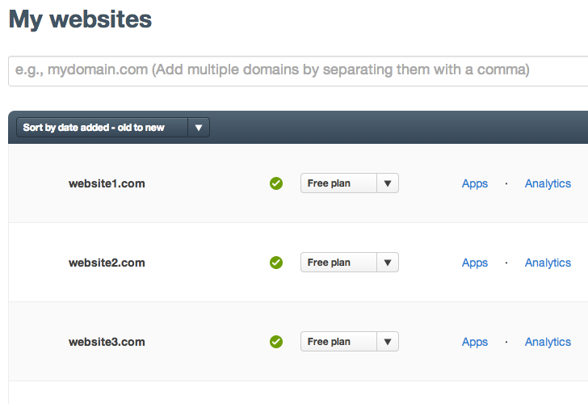

# Cloudflare Skinny Chrome Extension

A Chrome extension that reduces the height of the rows in the table of websites, making it easier to manage a large number of websites on CloudFlare.

Install by visiting the [Chrome Web Store](https://chrome.google.com/webstore/detail/cloudflare-skinny/icaedneoppcbggbadhkoaienhcckdabb).

## Screenshots

Before:  

After:  

## License

BSD-2 clause license. See LICENSE file.
